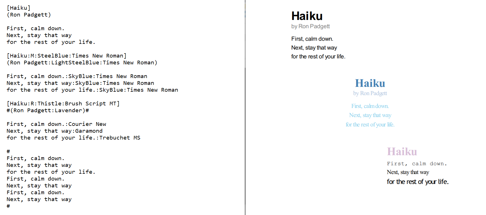
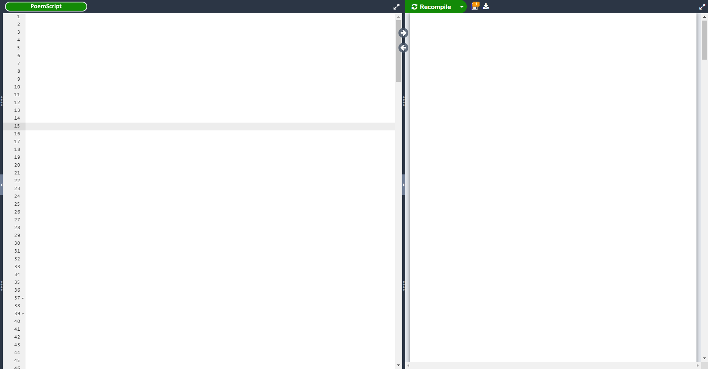

# PoemScript
My own markdown language for poems

### how to set up project :file_folder:

```
1) download this repo
2) pip install pdfkit
```

### how to use :question:

```
python processor.py [filename.txt]
```

#### standard syntax
```
// generates a <h1>-tag
[Title] 

// position poem to middle
[Title:M]

// position poem to right
[Title:R]

// generates a <p>-tag in gray saying "by Author"
(Author) 

// generates a <p>-tag
text 

// styles tag with given color
[Title:ColorName]
(Author:ColorName)
text:ColorName

// styles tag with given font
[Title:FontName]
(Author:FontName)
text:FontName

// specify font-size
[Title:32]
(Author:12)
text:16

// ignore line(s)
#
line(s) to ignore
#
```
#### example


### features :heavy_check_mark:
* Generates a html-file based on PoemScript file
* Generates a pdf-file based on PoemScript file

### todo :clipboard:
* separate css & html file (puts css in <style></style> for now because it causes problems with converting to pdf)
* specify background color
* style multiple lines at once
* handle multiple files at once
* configuration txt file instead of settings.py

### ideas :bulb:
* real time markdown website for making poems (like overleaf) (React & Django)


### bugs & cons :warning:
* unknown

### contributions :trophy:
* you could be on this list

### inspiration :recycle:
* I was reading poem collection by Ron Padgett and suddenly I came up with this idea

### communication :speech_balloon:
:email: if you have any questions feel free to mail me at isakhorvath@gmail.com

:beers: know how to improve the code? feel free to send a pull request! open for collaboration

:headphones: wanna hang out, talk about programming or work on a project? add me on discord: tavro#9198

:coffee: feeling generous? buy me a coffe https://www.buymeacoffee.com/CvaPyAznK

:star: if you found this useful or interesting I would appreciate a star 
