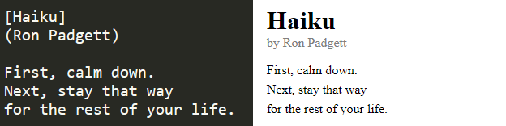

# PoemScript
My own markdown language for poems

### how to set up project :file_folder:

```
1) download this repo
```

### how to use :question:

```
python format.py [filename.txt]
```

#### standard syntax
```
// generates a <h1>-tag
[Title] 

// generates a <p>-tag in gray saying "by Author"
(Author) 

// generates a <p>-tag
text 
```
#### example


### features :heavy_check_mark:
* Generates a html-file based on PoemScript file

### todo :clipboard:
* this will be blank for now

### ideas :bulb:
* separate css & html file
* specify color, font and size 
* handle multiple files at once

### bugs & cons :warning:
* unknown at this point

### contributions :trophy:
* you could be on this list

### inspiration :recycle:
* I was reading poem collection by Ron Padgett and suddenly I came up with this idea

### communication :speech_balloon:
:email: if you have any questions feel free to mail me at isakhorvath@gmail.com

:beers: know how to improve the code? feel free to send a pull request! open for collaboration

:headphones: wanna hang out, talk about programming or work on a project? add me on discord: tavro#9198

:coffee: feeling generous? buy me a coffe https://www.buymeacoffee.com/CvaPyAznK

:star: if you found this useful or interesting I would appreciate a star 
